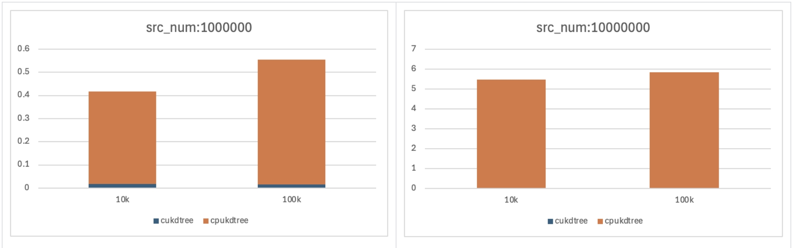

# cukdtree
warp the cudaKdtree into python api, original repo: https://github.com/ingowald/cudaKDTree

## performence



```
src_points: [1000_000,3]
cuda_kdtree:
    10000 time: 0.018298983573913574
    100000 time: 0.016928791999816895
    100000000 time: 0.19074087142944335

cpu_kdtree:
    10000 time: 0.39917306900024413
    100000 time: 0.5377137184143066
    100000000 time: >5min

================================
src_points: [10_000_000,3]
cuda_kdtree:
    10000 time: 0.018628931045532225
    100000 time: 0.016237854957580566
    100000000 time: 0.19780731201171875

cpu_kdtree:
    10000 time: 5.454591941833496
    100000 time: 5.822292685508728
    100000000 time: >5min
```

## install 

need to install torch first in your python env.

```shell
pip install https://github.com/CvHadesSun/cukdtree.git 

```

or 
```shell
git clone https://github.com/CvHadesSun/cukdtree.git
cd cukdtree && python setup.py install 
```

## usage

### example-1
```python
import torch # must import first
import cuda_kdtree
import time

device = torch.device("cuda")

points_ref = torch.randn(size=(100_000_000, 3), dtype=torch.float32, device=device, requires_grad=True) * 1e3
points_query = torch.randn(size=(100_1000_000, 3), dtype=torch.float32, device=device, requires_grad=True) * 1e3

t0=time.time()
cu_kdtree = cuda_kdtree.build_kdtree(points_ref)
t1 = time.time()
print('Time to build the KD-Tree on the GPU:', t1-t0)

t2 = time.time()
dists,indices = cuda_kdtree.query(points_query, points_ref,cu_kdtree)
t3 = time.time()
print('Time to search the 5 nearest neighbors on the GPU:', t3-t2)

```
**in this example, the cuda_kdtree will modfiy the input src points's order, if you want to return the original src points' order, you can reference example-2**

### example-2

```python
import torch # must import first
import cuda_kdtree
import time

device = torch.device("cuda")

num_src = 100_000_000
num_query = 100_1000_000

points_ref = torch.randn(size=(num_src, 3), dtype=torch.float32, device=device, requires_grad=True) * 1e3
points_query = torch.randn(size=(num_query, 3), dtype=torch.float32, device=device, requires_grad=True) * 1e3
points_ind = torch.arange(num_src, dtype=torch.int32, device=device)

box,data_ptr = cuda_kdtree.build_kdtree_with_indices(points_ref,points_ind)
dists,inds,ori_inds = cuda_kdtree.query_from_kdtree(points_query, data_ptr,ni,box)
final_inds = ori_inds[inds]

```


## change-log
- [x] warp kdtree, query knn=1 into python api 
- [] knn api
- [x] other input.
- [] class warp.


## reference
- https://github.com/ingowald/cudaKDTree